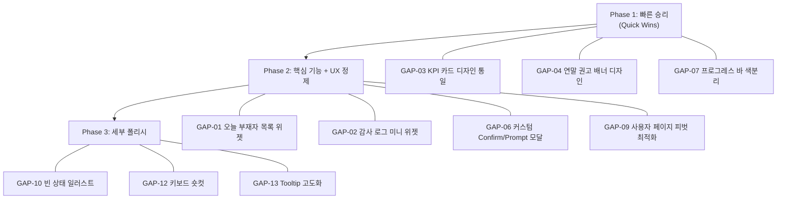
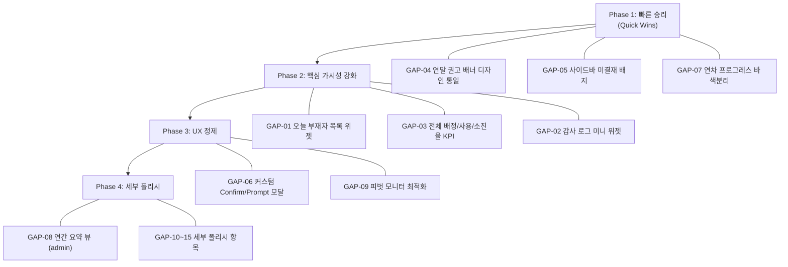

# SHIM UI 목업 마이그레이션 갭 분석 보고서

> **분석 기준**: [option_g.html](file:///v:/M2SSD/Documents/Project/SHIM/design/ui-mockup/option_g.html) (사용자 화면) + [admin_mockup.html](file:///v:/M2SSD/Documents/Project/SHIM/design/ui-mockup/admin_mockup.html) (관리자 화면)을 현재 구현([src/templates/](file:///v:/M2SSD/Documents/Project/SHIM/src/templates))과 1:1 대조한 결과입니다.
>
> **분석 일시**: 2026-06-19 | **최종 업데이트**: 사용자 피드백 반영 (항목 제외/재분류/이미 구현 확인)

---

## 1. 마이그레이션 완료 항목 ✅

| # | 영역 | 목업 요소 | 근거 |
|:-:|:---|:---|:---|
| 1 | Dense UI 디자인 시스템 | `dense-*` 색상 토큰, 라운드 카드, 폰트 가중치 | [app.css](file:///v:/M2SSD/Documents/Project/SHIM/src/static/css/app.css) |
| 2 | Navbar 레이아웃 | 상단 sticky nav, 브랜딩 배지, 로그아웃 | [base.html:L132-L160](file:///v:/M2SSD/Documents/Project/SHIM/src/templates/base.html#L132-L160) |
| 3 | Toast 알림 시스템 | `window.showToast()` + `window.alert` 오버라이드 | [base.html:L419-L486](file:///v:/M2SSD/Documents/Project/SHIM/src/templates/base.html#L419-L486) |
| 4 | 버튼 로딩 상태 | `simulateButtonLoading()` 전역 유틸 | [base.html:L451-L467](file:///v:/M2SSD/Documents/Project/SHIM/src/templates/base.html#L451-L467) |
| 5 | 사용자 대시보드 2컬럼 | 좌측 패널(나의 현황+간편 신청) + 우측 캘린더 | [user_dashboard.html](file:///v:/M2SSD/Documents/Project/SHIM/src/templates/user_dashboard.html) |
| 6 | 모바일 뷰 분리 | `md:hidden` / `hidden md:flex` 반응형 분기 | [user_dashboard.html](file:///v:/M2SSD/Documents/Project/SHIM/src/templates/user_dashboard.html) |
| 7 | 모바일 퀵 액션 허브 | 4칸 통계 그리드 + 3칸 퀵 액션 카드 | [user_dashboard.html](file:///v:/M2SSD/Documents/Project/SHIM/src/templates/user_dashboard.html) |
| 8 | 관리자 사이드바 | 접기/펼치기 토글 + 시스템 현황 카드 | [sidebar_admin.html](file:///v:/M2SSD/Documents/Project/SHIM/src/templates/partials/sidebar_admin.html) |
| 9 | 관리자 대시보드 차트 | 팀별 연차 사용 현황 + 월별 트렌드 차트 (Chart.js) | [admin_dashboard.html](file:///v:/M2SSD/Documents/Project/SHIM/src/templates/admin_dashboard.html) |
| 10 | 캘린더 뷰 전환 | 월간/연간 토글, 월 네비게이션 | [user_dashboard.html](file:///v:/M2SSD/Documents/Project/SHIM/src/templates/user_dashboard.html) |
| 11 | 다중 선택(Multi-Select) 모드 | 토글 버튼 + 플로팅 액션 바 + 일괄 신청 모달 | [user_dashboard.html](file:///v:/M2SSD/Documents/Project/SHIM/src/templates/user_dashboard.html) |
| 12 | 모달 시스템 | `window.shimModal` (open/close/ESC/Focus trap) | [base.html:L327-L374](file:///v:/M2SSD/Documents/Project/SHIM/src/templates/base.html#L327-L374) |
| 13 | 결재 상태별 필터 탭 | `전체 \| 대기 중 \| 승인됨 \| 반려됨` 탭 | [user_approvals.html:L49-L54](file:///v:/M2SSD/Documents/Project/SHIM/src/templates/user_approvals.html#L49-L54) |
| 14 | 관리자 마스터 설정 | 승인 워크플로우, 캘린더 공유 범위, 시간 정책, 브랜딩, DB 백업 | [admin_master.html](file:///v:/M2SSD/Documents/Project/SHIM/src/templates/admin_master.html) |
| 15 | 관리자 연간 요약 테이블 뷰 | 사용자별 12개월 사용 현황 매트릭스 (`타임라인형 \| 달력형 \| 연간 요약` 3탭) | [admin_leaves_calendar.html:L288-L381](file:///v:/M2SSD/Documents/Project/SHIM/src/templates/admin_leaves_calendar.html#L288-L381) |
| 16 | 좌측 패널 미니 목록 | 결재 대기 + 나의 신청 미니 카드 | 목업과 구현 동일 구조 확인 |
| 17 | 타임라인 뷰 전환 토글 | 상단 탭(페이지 간 전환) + 카드 내 뷰 토글(같은 페이지 내) | [user_team_calendar.html:L160-L206](file:///v:/M2SSD/Documents/Project/SHIM/src/templates/user_team_calendar.html#L160-L206) — 2단계 네비게이션 |

---

## 2. 미완료 (완료) 

> [!NOTE]
> **2026-06-19 기준 업데이트**: 아래의 모든 미완료 갭 항목(GAP-01 ~ GAP-13)에 대한 개선 개발 작업이 성공적으로 완료되었습니다.
> 상세 구현 내역은 [운영/릴리즈 통합 산출물](file:///v:/M2SSD/Documents/Project/SHIM/docs/2-1_운영_릴리즈_통합_산출물.md) v1.7.5 릴리즈 이력을 참고하십시오.
 갭 항목 — 최종 목록 🔧

### 2.1 🔴 높은 우선순위

---

#### GAP-01: 관리자 대시보드 — "오늘 부재자 목록" 위젯

| 항목 | 내용 |
|:---|:---|
| **목업** | [admin_mockup.html:L160-L165](file:///v:/M2SSD/Documents/Project/SHIM/design/ui-mockup/admin_mockup.html#L160-L165) — `👥 오늘 부재자 목록` 섹션. 부재자 이름/팀/시간대/사유를 카드형으로 표시 |
| **현재** | **완전 미구현**. 관리자가 오늘 누가 쉬는지 알려면 타임라인/캘린더 페이지로 이동 필요 |
| **핵심 영향** | SHIM 정체성 — "오늘 누가 쓸 수 있는 인력인가"를 가장 직접적으로 답하는 위젯 |
| **필요 작업** | ① 백엔드: 금일 `APPROVED`/`PENDING` 연차 조회 서비스 함수 ② 프론트: 부재자 리스트 카드 렌더링 ③ 라우터 컨텍스트에 데이터 주입 |
| **난이도** | **중** |

---

#### GAP-02: 관리자 대시보드 — "최근 주요 활동 로그" 미니 위젯

| 항목 | 내용 |
|:---|:---|
| **목업** | [admin_mockup.html:L167-L172](file:///v:/M2SSD/Documents/Project/SHIM/design/ui-mockup/admin_mockup.html#L167-L172) — `🔍 최근 주요 활동 로그` 위젯. 최근 5건 + "전체 보기 →" 링크 |
| **현재** | 감사 로그는 별도 페이지(`/admin/audit`)에만 존재. 대시보드 미리보기 없음 |
| **필요 작업** | ① 백엔드: 최근 5~10건 `AuditLog` 조회 ② 프론트: 미니 카드 + "전체 보기 →" 링크 ③ `actor_name`/`actor_department` 스냅샷 활용 |
| **난이도** | **하~중** |

---

#### GAP-03: 관리자 대시보드 — KPI 카드 디자인 통일

| 항목 | 내용 |
|:---|:---|
| **목업** | [admin_mockup.html:L122-L140](file:///v:/M2SSD/Documents/Project/SHIM/design/ui-mockup/admin_mockup.html#L122-L140) — 카드 내부에 아이콘, 라벨, 큰 숫자, 서브텍스트가 있는 디자인 |
| **현재** | [admin_dashboard.html:L33-L52](file:///v:/M2SSD/Documents/Project/SHIM/src/templates/admin_dashboard.html#L33-L52) — 기존 4개 카드(`활성 사원 수`, `금일 신청 건수`, `결재 대기 건수`, `금일 사용 연차`)의 **데이터는 유지**, 디자인 스타일만 목업과 맞춤 |
| **변경 범위** | 카드 레이아웃·색상·타이포그래피를 목업 스타일로 통일. **새로운 데이터 쿼리 불필요** |
| **난이도** | **하** (CSS/HTML 변경만) |

---

#### GAP-04: 관리자 대시보드 — 연말/연초 권고 배너 디자인

| 항목 | 내용 |
|:---|:---|
| **목업** | [admin_mockup.html:L105-L120](file:///v:/M2SSD/Documents/Project/SHIM/design/ui-mockup/admin_mockup.html#L105-L120) — **빨간색** 경고 톤 + ⚠️ 아이콘 + "닫기" 버튼 |
| **현재** | [admin_dashboard.html:L20-L31](file:///v:/M2SSD/Documents/Project/SHIM/src/templates/admin_dashboard.html#L20-L31) — **파란색** 정보 톤. 닫기 버튼 없음 |
| **필요 작업** | 색상 변경(`border-red-200 bg-red-50`) + ⚠️ 아이콘 + 닫기 버튼 추가 |
| **난이도** | **하** |

---

### 2.2 🟡 중간 우선순위

---

#### GAP-06: 커스텀 Confirm/Prompt 모달

| 항목 | 내용 |
|:---|:---|
| **현재** | 승인 시 네이티브 `confirm()`, 반려 사유 입력 시 네이티브 `prompt()` 사용 중 |
| **필요 작업** | `window.shimModal` 확장: `shimModal.confirm(message)` → `Promise<boolean>`, `shimModal.prompt(message)` → `Promise<string\|null>` + 기존 호출부 전환 |
| **난이도** | **중** (영향 범위 넓음) |

> [!WARNING]
> `prompt()`는 최신 크로스오리진 iframe에서 차단되며, 일부 브라우저에서 보안 정책으로 비활성화될 수 있습니다. 커스텀 모달 전환은 호환성 보장 측면에서도 중요합니다.

---

#### GAP-07: 연차 프로그레스 바 3구간 색분리

| 항목 | 내용 |
|:---|:---|
| **현재** | [user_left_panel.html:L10-L12](file:///v:/M2SSD/Documents/Project/SHIM/src/templates/partials/user_left_panel.html#L10-L12) — 단일 파란색 바 |
| **필요 작업** | ① 대기(`PENDING`) 시간 집계 추가 ② 사용(파란) / 대기(앰버) / 잔여(회색) 3구간 ③ 소진율 퍼센트 텍스트 |
| **난이도** | **하~중** |

---

#### GAP-09: 사용자 페이지 피벗(세로형) 모니터 최적화

| 항목 | 내용 |
|:---|:---|
| **대상** | **사용자 페이지만** (관리자 페이지 제외) |
| **필요 작업** | [user_dashboard.html](file:///v:/M2SSD/Documents/Project/SHIM/src/templates/user_dashboard.html), [user_left_panel.html](file:///v:/M2SSD/Documents/Project/SHIM/src/templates/partials/user_left_panel.html), [user_team_calendar.html](file:///v:/M2SSD/Documents/Project/SHIM/src/templates/user_team_calendar.html)에 CSS 미디어쿼리 조정 |
| **난이도** | **하~중** |

---

### 2.3 🟢 낮은 우선순위

| # | 항목 | 내용 | 난이도 |
|:-:|:---|:---|:---:|
| GAP-10 | **빈 상태 일러스트 통일** | 데이터 없을 때 일관된 이모지+안내+CTA 패턴 적용 | 하 |
| GAP-12 | **키보드 숏컷** | ←/→ 키로 월간 뷰 전환 | 하 |
| GAP-13 | **호버 Tooltip 고도화** | `title=""` → CSS/JS 기반 미니 Popover | 중 |

---

## 3. 기술적 고려사항 ⚠️

### 3.1 아키텍처 제약

| 제약 | 영향 | 대응 |
|:---|:---|:---|
| **Jinja2 SSR** | SPA처럼 탭 간 상태를 JS로 관리할 수 없음 | 페이지 이동(`<a href>`)으로 구현하거나 `hidden` 클래스 토글 |
| **외부 CDN 금지** | 목업의 `cdn.tailwindcss.com` 등 사용 불가 | 로컬 빌드 파일 사용 (이미 적용됨) |
| **SQLite 성능** | 대시보드 위젯 쿼리 추가 시 N+1 방지 필수 | 벌크 `in_()` 쿼리 + 메모리 맵핑 패턴 준수 |

### 3.2 PII 암호화 영향

- 대시보드 위젯에서 사용자 이름 노출 시 `EncryptedString`으로 암호화된 `user_name` 필드 **복호화** 필요
- 오늘 부재자 목록, 감사 로그 미니 위젯 등 새 위젯 추가 시 서비스 레이어 복호화 로직 확인 필요
- 300명 규모 벌크 조회 시 복호화 오버헤드 수용 가능 여부 검증

### 3.3 성능 영향도

| 신규 쿼리 | 대응 |
|:---|:---|
| 오늘 부재자 조회 | 인덱스 활용 (`date` + `status`) |
| 최근 감사 로그 | `ORDER BY id DESC LIMIT 10` |

---

## 4. 구현 로드맵

### Phase 1: 빠른 승리 (예상 1~2일)

| 작업 | 대상 파일 | 변경 유형 | 백엔드 |
|:---|:---|:---:|:---:|
| GAP-03: KPI 카드 디자인 통일 | [admin_dashboard.html](file:///v:/M2SSD/Documents/Project/SHIM/src/templates/admin_dashboard.html) | HTML/CSS | ❌ |
| GAP-04: 연말 배너 빨간색 경고 톤 + 닫기 버튼 | [admin_dashboard.html](file:///v:/M2SSD/Documents/Project/SHIM/src/templates/admin_dashboard.html) | CSS/JS | ❌ |
| GAP-07: 프로그레스 바 3구간 색분리 | [user_left_panel.html](file:///v:/M2SSD/Documents/Project/SHIM/src/templates/partials/user_left_panel.html) | HTML/CSS | 최소 (대기 시간 집계) |

### Phase 2: 핵심 기능 + UX 정제 (예상 3~5일)

| 작업 | 대상 파일 | 변경 유형 | 백엔드 |
|:---|:---|:---:|:---:|
| GAP-01: 오늘 부재자 목록 위젯 | [admin_dashboard.html](file:///v:/M2SSD/Documents/Project/SHIM/src/templates/admin_dashboard.html) + 서비스/라우터 | 신규 위젯 | 서비스 쿼리 1개 |
| GAP-02: 감사 로그 미니 위젯 | [admin_dashboard.html](file:///v:/M2SSD/Documents/Project/SHIM/src/templates/admin_dashboard.html) + 서비스/라우터 | 신규 위젯 | 쿼리 1개 |
| GAP-06: 커스텀 Confirm/Prompt 모달 | [base.html](file:///v:/M2SSD/Documents/Project/SHIM/src/templates/base.html) + 전체 호출부 | JS 인프라 | ❌ |
| GAP-09: 사용자 피벗 최적화 | [user_dashboard.html](file:///v:/M2SSD/Documents/Project/SHIM/src/templates/user_dashboard.html), [user_left_panel.html](file:///v:/M2SSD/Documents/Project/SHIM/src/templates/partials/user_left_panel.html), [user_team_calendar.html](file:///v:/M2SSD/Documents/Project/SHIM/src/templates/user_team_calendar.html) | CSS | ❌ |

### Phase 3: 세부 폴리시 (예상 1~3일)

| 작업 | 대상 파일 | 변경 유형 | 백엔드 |
|:---|:---|:---:|:---:|
| GAP-10: 빈 상태 일러스트 통일 | 여러 템플릿 | HTML | ❌ |
| GAP-12: 키보드 숏컷 | [user_dashboard.html](file:///v:/M2SSD/Documents/Project/SHIM/src/templates/user_dashboard.html) | JS | ❌ |
| GAP-13: Tooltip 고도화 | 여러 템플릿 | CSS/JS | ❌ |

---

## 5. 총괄 현황

| 구분 | 갭 수 | 예상 소요 | 백엔드 변경 |
|:---:|:---:|:---:|:---:|
| 🔴 높은 (Phase 1+2 일부) | 4개 | 2~4일 | 서비스 쿼리 2개 |
| 🟡 중간 (Phase 2 나머지) | 3개 | 2~3일 | 없음 |
| 🟢 낮은 (Phase 3) | 3개 | 1~3일 | 없음 |
| **총합** | **10개** | **약 5~10일** | |

---

## 부록: 제외 항목 이력

| 이전 번호 | 항목 | 제외 사유 |
|:-:|:---|:---|
| GAP-05 | 사이드바 미결재 배지 카운터 | 사용자 요청으로 제외 |
| GAP-08 | 관리자 연간 요약 테이블 뷰 | 이미 완전 구현됨 → 완료 항목 #15로 이동 |
| GAP-11 | 상대 시간 표시 ("3분 전") | 사용자 요청으로 제외 |
| GAP-14 | 좌측 패널 미니 목록 중복 정리 | 목업과 구현 일치 → 갭 아님 |
| GAP-15 | 타임라인 뷰 내 중복 토글 제거 | 2단계 네비게이션 설계 → 중복 아님 |
�버헤드가 수용 가능한지 검증

### 3.3 성능 영향도

| 신규 쿼리 | 위험 | 대응 |
|:---|:---|:---|
| 전체 연차 배정/사용 합산 KPI | 전체 사용자 × Allocation 조회 | SQL `SUM()` 단일 쿼리 |
| 오늘 부재자 조회 | 날짜 + 상태 필터 | 인덱스 활용 (`date` + `status`) |
| 최근 감사 로그 | 최신 5~10건 | `ORDER BY id DESC LIMIT 10` |
| 연간 요약 테이블 | 사용자 수 × 12개월 매트릭스 | 서비스 레이어에서 한 번 집계 후 딕셔너리 전달 |

---

## 4. 수정 계획 (완료) 

> [!NOTE]
> **Phase 1, 2, 3, 4의 모든 개선 과제가 2026-06-19 완료**되어 실제 운영 환경에 반영되었습니다.
 — 4단계 구현 로드맵

### Phase 1: 빠른 승리 (예상 1~2일)

| 작업 | 대상 파일 | 변경 유형 | 백엔드 |
|:---|:---|:---:|:---:|
| GAP-04: 연말 배너 빨간색 경고 톤 + 닫기 버튼 | [admin_dashboard.html](file:///v:/M2SSD/Documents/Project/SHIM/src/templates/admin_dashboard.html) | CSS 변경 | ❌ |
| GAP-05: 사이드바 미결재 배지 | [sidebar_user.html](file:///v:/M2SSD/Documents/Project/SHIM/src/templates/partials/sidebar_user.html) + 전역 컨텍스트 | HTML 추가 | 최소 (변수 1개) |
| GAP-07: 프로그레스 바 3구간 색분리 | [user_left_panel.html](file:///v:/M2SSD/Documents/Project/SHIM/src/templates/partials/user_left_panel.html) | HTML/CSS | 최소 (대기 시간 집계) |

### Phase 2: 핵심 가시성 강화 (예상 3~5일)

| 작업 | 대상 파일 | 변경 유형 | 백엔드 |
|:---|:---|:---:|:---:|
| GAP-01: 오늘 부재자 목록 위젯 | [admin_dashboard.html](file:///v:/M2SSD/Documents/Project/SHIM/src/templates/admin_dashboard.html) + 서비스/라우터 | 신규 위젯 | 서비스 쿼리 1개 |
| GAP-03: 전체 배정/사용/소진율 KPI | [admin_dashboard.html](file:///v:/M2SSD/Documents/Project/SHIM/src/templates/admin_dashboard.html) + 서비스/라우터 | 신규 카드 3개 | SQL SUM 쿼리 |
| GAP-02: 감사 로그 미니 위젯 | [admin_dashboard.html](file:///v:/M2SSD/Documents/Project/SHIM/src/templates/admin_dashboard.html) + 서비스/라우터 | 신규 위젯 | 쿼리 1개 |

### Phase 3: UX 정제 (예상 2~3일)

| 작업 | 대상 파일 | 변경 유형 | 백엔드 |
|:---|:---|:---:|:---:|
| GAP-06: 커스텀 Confirm/Prompt 모달 | [base.html](file:///v:/M2SSD/Documents/Project/SHIM/src/templates/base.html) + 전체 `confirm()`/`prompt()` 호출 교체 | JS 인프라 + 전파 | ❌ |
| GAP-09: 피벗 모니터 최적화 | [user_dashboard.html](file:///v:/M2SSD/Documents/Project/SHIM/src/templates/user_dashboard.html), [user_left_panel.html](file:///v:/M2SSD/Documents/Project/SHIM/src/templates/partials/user_left_panel.html) | CSS 미디어쿼리 | ❌ |

### Phase 4: 세부 폴리시 (예상 3~5일)

| 작업 | 대상 파일 | 변경 유형 | 백엔드 |
|:---|:---|:---:|:---:|
| GAP-08: 관리자 연간 요약 테이블 뷰 | 신규 페이지 또는 기존 캘린더 확장 | 신규 뷰 | 월별 집계 쿼리 |
| GAP-10~15: 빈 상태 일러스트, 상대 시간, 키보드 숏컷 등 | 여러 템플릿 | 점진적 개선 | 최소 |

---

## 5. 갭 항목 총괄 현황

| 우선순위 | 완료 갭 수 | 예상 소요 | 백엔드 변경 규모 |
|:---:|:---:|:---:|:---:|
| 🔴 높은 | 5개 (GAP-01~05) | 3~5일 | 서비스 쿼리 3~4개 |
| 🟡 중간 | 4개 (GAP-06~09) | 3~5일 | 라우터 파라미터 추가 |
| 🟢 낮은 | 6개 (GAP-10~15) | 2~4일 | 최소 |
| **총합** | **0개** | **완료** | |

---

## 6. 결론 및 권장사항

> [!IMPORTANT]
> 목업 대비 현재 구현은 **핵심 골격(레이아웃/디자인 시스템/모바일 뷰/모달/결재 필터)이 성공적으로 마이그레이션**된 상태입니다. 남은 15개 갭 항목은 대부분 **대시보드 위젯 추가**(GAP-01~03)와 **세부 UI 폴리시**(GAP-06~15) 영역에 집중되어 있습니다.

### 권장 실행 순서

1. **Phase 1을 즉시 착수** — CSS 변경과 컨텍스트 변수 1개 추가만으로 3개 갭을 동시에 해소할 수 있어 투입 대비 효과가 가장 높습니다.
2. **Phase 2에서 SHIM 정체성 강화** — "오늘 부재자 목록"과 "전체 소진율 KPI"는 SHIM의 핵심 가치("오늘 누가 쓸 수 있는 인력인가")를 직접적으로 답하는 위젯이므로 반드시 구현을 권장합니다.
3. **Phase 3~4는 점진적으로** — 커스텀 모달이나 연간 요약 뷰는 기능적으로 동작하는 현재 상태에서 여유 시 진행해도 무방합니다.

### 기존 갭 분석 대비 변경점

| 이전 갭 분석 항목 | 현재 상태 |
|:---|:---|
| 결재 상태별 필터 탭 (§2.3.2) | ✅ **해결됨** — `user_approvals.html`에 4개 상태 탭 구현 완료 |
| 나머지 항목들 | 🔧 여전히 미해결 — 본 보고서에서 재정리 |
