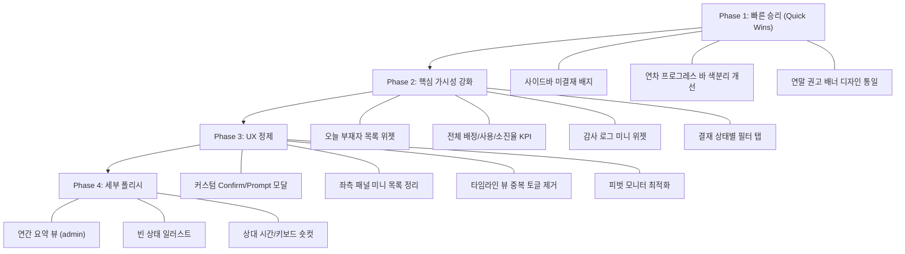

# SHIM UI/UX 갭 분석 리포트

> 목업 파일([admin_mockup.html](../admin_mockup.html), [option_g.html](../option_g.html))과 현재 실제 구현([src/templates/](../../../src/templates)) 간의 차이를 분석하고, 남은 개선 작업과 고려사항을 도출합니다.

---

## 1. 이미 완료된 항목 ✅

현재 구현이 목업과 이미 일치하거나 완료된 핵심 영역입니다.

| 영역 | 상세 | 근거 파일 |
|:---|:---|:---|
| **Dense UI 디자인 시스템** | `dense-*` 색상 토큰, 라운드 카드, 폰트 가중치 체계 일치 | [app.css](../../../src/static/css/app.css), [tailwind.css](../../../src/static/css/tailwind.css) |
| **Navbar 레이아웃** | 상단 sticky nav, 배지+브랜드 네이밍, 로그아웃 링크 | [base.html](../../../src/templates/base.html) |
| **Toast 알림 시스템** | `window.showToast()` + `window.alert` 오버라이드 구현 완료 | [base.html:L419-L486](../../../src/templates/base.html#L419-L486) |
| **버튼 로딩 상태** | `simulateButtonLoading()` 전역 유틸 함수 구현 | [base.html:L451-L467](../../../src/templates/base.html#L451-L467) |
| **사용자 대시보드 2컬럼 레이아웃** | 좌측 패널(나의 현황+간편 신청) + 우측 캘린더 구조 일치 | [user_dashboard.html](../../../src/templates/user_dashboard.html) |
| **모바일 뷰 분리** | `md:hidden` / `hidden md:flex` 반응형 분기 적용 | [user_dashboard.html:L114-L464](../../../src/templates/user_dashboard.html#L114-L464) |
| **모바일 퀵 액션 허브** | 4칸 통계 그리드 + 3칸 퀵 액션 카드 목업과 일치 | [user_dashboard.html:L322-L358](../../../src/templates/user_dashboard.html#L322-L358) |
| **관리자 사이드바** | 접기/펼치기 토글, 시스템 현황 카드 | [sidebar_admin.html](../../../src/templates/partials/sidebar_admin.html) |
| **관리자 대시보드 차트** | 팀별 연차 사용 현황 + 월별 트렌드 차트(Chart.js) | [admin_dashboard.html:L54-L237](../../../src/templates/admin_dashboard.html#L54-L237) |
| **캘린더 뷰 전환** | 월간/연간 토글, 월 네비게이션 | [user_dashboard.html:L146-L160](../../../src/templates/user_dashboard.html#L146-L160) |
| **다중 선택(Multi-Select) 모드** | 토글 버튼 + 플로팅 액션 바 + 일괄 신청 모달 | [user_dashboard.html:L152-L482](../../../src/templates/user_dashboard.html#L152-L482) |
| **모달 시스템** | `window.shimModal` (open/close/ESC/Focus trap) | [base.html:L327-L374](../../../src/templates/base.html#L327-L374) |

---

## 2. 아직 개선이 필요한 항목 🔧

### 2.1 [높은 우선순위] 사용자 화면 (option_g 기준)

#### 2.1.1 좌측 패널 미니 목록 중복 정리
- **목업 상태**: option_g에서 좌측에 결재 대기 목록 + 나의 신청 내역 미니 리스트가 있음
- **현재 상태**: [user_left_panel.html](../../../src/templates/partials/user_left_panel.html)에 해당 미니 리스트가 구현되어 있으나, 우측 메인 영역의 탭(결재 관리/내 신청 내역)과 기능적으로 **중복**
- **개선 방향**: [3-1 백로그](../../../docs/3-1_향후_개선계획.md#L26-L28)에도 이미 등록된 P3 과제. 좌측은 **나의 상태 요약 + 간편 신청 폼**으로 한정하고 미니 리스트 제거 검토

> [!IMPORTANT]
> 이 변경은 사용자 동선에 직접적인 영향을 미칩니다. 제거 시 "한 눈에 보이는 미결재 건수" UX가 사라지므로, 사이드바 배지 카운터(§2.1.2)와 반드시 함께 진행해야 합니다.

#### 2.1.2 사이드바 미결재 배지(Badge) 카운터
- **목업 상태**: option_g에서 좌측 결재 대기 카드에 숫자 배지가 명시적으로 표시
- **현재 상태**: [sidebar_user.html](../../../src/templates/partials/sidebar_user.html)에 결재 관리 링크는 있으나 **배지 카운터 미구현**
- **개선안**: 백엔드에서 `pending_approval_count`를 전역 컨텍스트로 주입 → 사이드바 링크 옆에 `` 배지 추가
- **난이도**: 하

#### 2.1.3 타임라인 뷰 내 중복 뷰 전환 토글 제거
- **현재 상태**: 개인 페이지 → 타임라인 탭 진입 시, 상단 메인 탭바에 '타임라인'이 이미 선택되어 있는데도 카드 내부에 다시 뷰 전환 토글이 노출
- **개선 방향**: [3-1 백로그](../../../docs/3-1_향후_개선계획.md#L29-L31)에 등록된 P3 과제. 타임라인 뷰 내부의 중복 토글을 제거하여 UX 흐름 정돈

#### 2.1.4 연차 잔여량 프로그레스 바 개선
- **목업 상태**: option_g 좌측 패널에 사용률 프로그레스 바가 시각적으로 명확하게 표시
- **현재 상태**: 좌측 패널에 프로그레스 바 자체는 있으나, 목업 대비 **비율 표기**나 **색상 분리**(사용/대기/잔여)가 부족
- **개선안**: 사용(파란색) / 대기(앰버) / 잔여(회색) 구간 색분리 프로그레스 바 + 소진율 퍼센트 텍스트 추가

---

### 2.2 [높은 우선순위] 관리자 화면 (admin_mockup 기준)

#### 2.2.1 관리자 대시보드 — "오늘 부재자 목록" 위젯 부재
- **목업 상태**: admin_mockup에 `👥 오늘 부재자 목록 (6월 13일)` 섹션이 차트 하단에 배치
- **현재 상태**: [admin_dashboard.html](../../../src/templates/admin_dashboard.html)에 해당 위젯 **미구현**
- **핵심 가치**: SHIM의 정체성 — "**오늘 누가 쓸 수 있는 인력인가**"를 가장 직접적으로 답하는 위젯
- **개선안**: 백엔드에서 금일 승인/대기 상태 연차 조회 → 부재자 리스트 카드 렌더링
- **난이도**: 중 (서비스 레이어 쿼리 추가 + 프론트엔드 카드)

#### 2.2.2 관리자 대시보드 — "최근 주요 활동 로그" 미니 위젯
- **목업 상태**: admin_mockup에 `🔍 최근 주요 활동 로그` 위젯이 대시보드에 인라인으로 배치 (감사 로그 페이지 이동 없이 주요 이벤트 미리보기)
- **현재 상태**: 대시보드에는 "최근 7일 신청 타임라인" 테이블만 있고, 감사 로그 미니 위젯은 **별도 페이지**(/admin/audit)에만 존재
- **개선안**: 최근 5~10건의 주요 AuditLog를 대시보드에 미니 카드로 표시 + "전체 보기 →" 링크

#### 2.2.3 관리자 대시보드 — 전체 연차 배정/사용/소진율 KPI 카드
- **목업 상태**: admin_mockup에 `전체 연차 배정 시간(960h)`, `전체 연차 사용 시간(148h)`, `전체 연차 소진율(15.4%)` 3개 KPI 카드 + 프로그레스 바
- **현재 상태**: [admin_dashboard.html](../../../src/templates/admin_dashboard.html#L33-L52)에는 `활성 사원 수`, `금일 신청 건수`, `결재 대기 건수`, `금일 사용 연차` 4개 카드만 존재. **전체 배정/사용/소진율**은 미구현
- **개선안**: 백엔드에서 전체 사용자의 연차 배정/사용 합산 → 3개 KPI 카드 추가 (기존 4개와 병행 또는 대체)

#### 2.2.4 관리자 대시보드 — 연말/연초 권고 배너
- **목업 상태**: admin_mockup 대시보드 상단에 빨간색 경고 배너 `[새해 연차 일괄 지급 권고]` + CTA 버튼
- **현재 상태**: [admin_dashboard.html:L20-L31](../../../src/templates/admin_dashboard.html#L20-L31)에 파란색 알림 배너가 존재하지만 디자인 톤이 목업과 다름 (파란색 vs 빨간색 경고)
- **개선안**: 목업처럼 `border-red-200 bg-red-50` 경고 톤으로 변경 + 닫기 버튼 추가 검토

#### 2.2.5 관리자 연차 캘린더 — "연간 요약" 탭
- **목업 상태**: admin_mockup의 연차 관리 섹션에 `타임라인 | 캘린더 | 연간 요약` 3개 탭이 있고, 연간 요약에는 사용자별 12개월 사용 현황 테이블이 배치
- **현재 상태**: [admin_leaves_calendar.html](../../../src/templates/admin_leaves_calendar.html)과 [admin_leaves_timeline.html](../../../src/templates/admin_leaves_timeline.html)이 **별도 페이지**로 구현되어 있으나, "연간 요약" 뷰는 **미구현**
- **개선안**: 연간 요약 테이블 뷰 구현 (사용자별 배정/사용/잔여 + 월별 사용 시간 히트맵)
- **난이도**: 중~상 (백엔드 월별 집계 쿼리 + 프론트엔드 테이블 렌더링)

---

### 2.3 [중간 우선순위] 공통 개선

#### 2.3.1 커스텀 Confirm/Prompt 모달
- **목업 상태**: 목업에서는 모든 확인 대화상자가 커스텀 모달
- **현재 상태**: 승인 시 네이티브 `confirm()`, 반려 사유 입력 시 네이티브 `prompt()` 사용 중
- **개선안**: 기존 `window.shimModal` 인프라를 확장하여 `shimModal.confirm(message)` → Promise\<boolean\>, `shimModal.prompt(message)` → Promise\<string|null\> 구현
- **난이도**: 중

> [!WARNING]
> `prompt()`는 최신 크로스오리진 iframe에서 차단되며, 일부 브라우저에서 보안 정책으로 비활성화될 수 있습니다. 커스텀 모달 전환은 호환성 보장 측면에서도 중요합니다.

#### 2.3.2 결재 관리 — 상태별 필터 탭
- **목업 상태**: option_g의 결재 관리 뷰에 `전체 | 대기 중 | 승인됨 | 반려됨` 필터 탭 존재
- **현재 상태**: [user_approvals.html](../../../src/templates/user_approvals.html)에서 PENDING 상태만 표시 → 이전 승인/반려 이력 확인 불가
- **개선안**: 라우터에 `status` 쿼리 파라미터 + 서비스 레이어 필터 추가 + 상태별 탭 UI
- **난이도**: 중

#### 2.3.3 피벗(세로형) 모니터 및 좁은 화면 최적화
- **현재 상태**: 2컬럼 가로 배치가 피벗 모니터(1080px 세로)에서 가로 스크롤 유발 가능
- **개선안**: 미디어 쿼리 경계값(lg: 1024px) 이하에서 좌측 패널과 우측 영역을 수직 스택으로 전환
- **난이도**: 하~중

---

### 2.4 [낮은 우선순위] 세부 폴리시

| 항목 | 목업 vs 현재 차이 | 난이도 |
|:---|:---|:---:|
| **빈 상태 일러스트** | 데이터 없을 때 목업에서는 친절한 안내 + 이모지, 현재는 단순 텍스트 | 하 |
| **상대 시간 표시** | 감사 로그에서 목업은 "3분 전" 형태 표시, 현재는 절대 시각만 | 하 |
| **키보드 숏컷** | 목업에서 `←`/`→`로 월 전환, 현재는 버튼 클릭만 | 하 |
| **호버 Tooltip 고도화** | 목업은 CSS 기반 미니 Popover, 현재는 `title=""` 속성만 | 중 |
| **브레드크럼 네비게이션** | 목업에 없지만 백로그에 등록됨, 현재 미구현 | 하 |

---

## 3. 구현 시 주의해야 할 기술적 고려사항 ⚠️

### 3.1 아키텍처 제약

| 제약 | 영향 | 대응 |
|:---|:---|:---|
| **Jinja2 SSR** | SPA처럼 탭 간 상태를 JS로 관리할 수 없음. 각 페이지가 독립적 SSR 렌더링 | 목업의 SPA 스타일 탭 전환을 실제 구현 시 **페이지 이동**(a href)으로 구현하거나, 필요한 경우 JS로 `hidden` 클래스 토글 방식 사용 |
| **외부 CDN 금지** | 목업에서 사용된 `cdn.tailwindcss.com`, `cdn.jsdelivr.net/npm/chart.js`는 실제 구현에서 사용 불가 | 로컬 [tailwind.css](../../../src/static/css/tailwind.css) + [chart.umd.js](../../../src/static/js/chart.umd.js) 사용 (이미 적용됨) |
| **SQLite 성능** | 대시보드 KPI(전체 배정/사용 합산), 오늘 부재자 조회 등 새 쿼리 추가 시 N+1 방지 필수 | 벌크 `in_()` 쿼리 + 메모리 맵핑 패턴 준수 |

### 3.2 디자인 시스템 일관성

> [!IMPORTANT]
> 목업과 실제 구현 사이의 **미묘한 디자인 차이**에 주의하세요.

- **목업은 Tailwind CDN(v3)** 사용, 실제는 **Tailwind v4** 빌드. 일부 유틸리티 클래스 문법이 다를 수 있음
- 목업의 `rounded-2xl`, `shadow-sm` 등은 로컬 빌드의 토큰 값과 정확히 일치하는지 확인 필요
- 목업에서 이모지(`📊`, `📅`)를 아이콘으로 사용 → 실제 구현에서는 동일하게 이모지를 사용 중 (SVG 아이콘으로의 전환은 현 단계에서 불필요)

### 3.3 PII 암호화 영향

- 대시보드 위젯에서 사용자 이름을 노출할 때, `EncryptedString`으로 암호화된 `user_name` 필드를 **복호화해서** 표시해야 함
- 오늘 부재자 목록, 감사 로그 미니 위젯 등 새 위젯 추가 시 서비스 레이어에서 복호화 로직이 이미 적용되어 있는지 확인 필요
- 벌크 조회 시 복호화 오버헤드가 300명 규모에서도 수용 가능한 수준인지 검증

### 3.4 감사 로그(AuditLog) 연계

- 대시보드에 감사 로그 미니 위젯을 추가할 경우, `actor_name`, `actor_department` 스냅샷 필드를 활용하여 사용자 삭제 후에도 로그 가독성 유지
- 외래키 안전성: `actor_id`가 NULL인 경우(사용자 삭제 후)의 표시 처리

### 3.5 모바일 뷰 동기화

- 목업의 모바일 뷰(option_g)는 SPA 스타일로 `switchMobileTabG()` 함수로 뷰를 전환
- 실제 구현에서는 별도 페이지로 이동하는 방식(`<a href="/user/team-calendar">`)을 사용
- **의도적 차이**: SSR 기반에서는 이 방식이 더 적합 (상태 관리 복잡도 감소)

### 3.6 성능 고려

| 항목 | 위험 | 대응 |
|:---|:---|:---|
| 전체 연차 배정/사용 합산 KPI | 전체 사용자 × 연도별 Allocation 조회 | SQL 집계 함수(`SUM`)로 단일 쿼리 처리 |
| 월별 사용 트렌드 차트 데이터 | 12개월 × 전체 사용자 연차 집계 | 월별 `GROUP BY` 단일 쿼리 |
| 오늘 부재자 조회 | 날짜 + 상태 필터 | 인덱스 활용 (`date` + `status` 복합 인덱스 확인) |
| 연간 요약 테이블 | 사용자 수 × 12개월 매트릭스 | 서비스 레이어에서 한 번 집계 후 딕셔너리 전달 |

---

## 4. 권장 작업 순서

| Phase | 예상 소요 | 포함 항목 수 | 백엔드 변경 |
|:---:|:---:|:---:|:---:|
| **Phase 1** | 1~2일 | 3개 | 최소 (컨텍스트 변수 1개 추가) |
| **Phase 2** | 3~5일 | 4개 | 서비스 레이어 쿼리 3~4개 추가 |
| **Phase 3** | 2~3일 | 4개 | 라우터 파라미터 추가 |
| **Phase 4** | 3~5일 | 3개 | 서비스 레이어 집계 쿼리 추가 |

---

## 5. 목업과 실제 구현의 본질적 차이 (참고)

> [!NOTE]
> 목업은 **단일 HTML 파일 + CDN + Mock JS 데이터**로 구성된 프로토타입입니다. 실제 구현으로 옮길 때 아래 차이를 항상 인식해야 합니다.

| 차원 | 목업 | 실제 구현 |
|:---|:---|:---|
| **데이터** | JS 하드코딩 배열 | SQLite DB + 서비스 레이어 조회 |
| **라우팅** | 단일 파일 내 `hidden` 토글 | FastAPI 라우터 + Jinja2 SSR 페이지 |
| **스타일** | Tailwind CDN (v3) | 로컬 빌드 Tailwind CSS v4 |
| **차트** | Chart.js CDN | `/static/js/chart.umd.js` (로컬) |
| **인증** | 없음 | JWT + HttpOnly Cookie |
| **권한 분기** | 없음 | RBAC (STAFF/TEAM_LEAD/PM/ADMIN) |
| **PII** | 평문 | EncryptedString (Fernet) |

이 차이 때문에 목업의 모든 UI 요소를 1:1로 옮기는 것보다, **사용자 가치가 높은 핵심 패턴**을 우선 이식하고 나머지는 점진적으로 개선하는 접근이 적합합니다.
